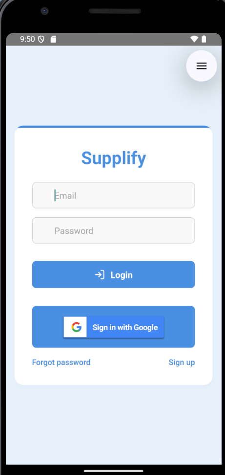
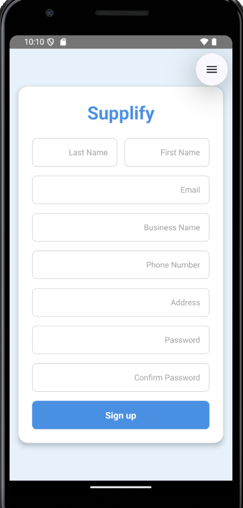
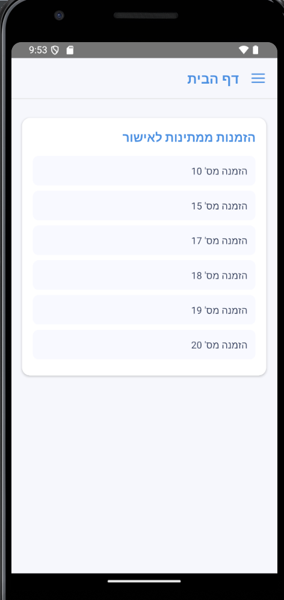
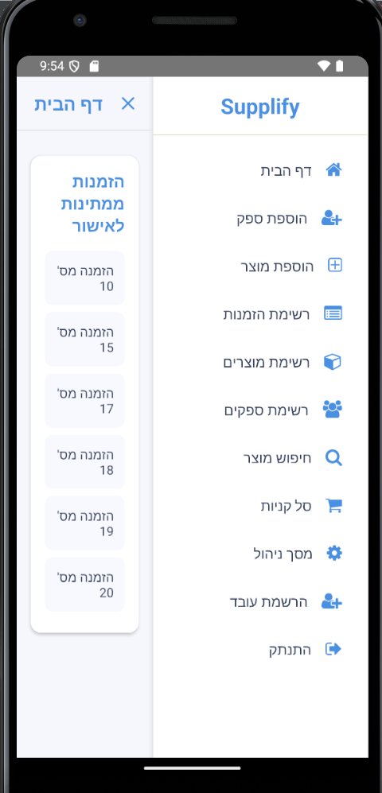
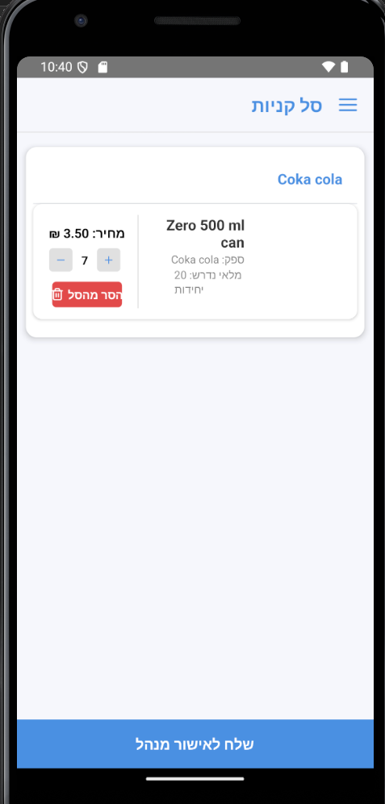
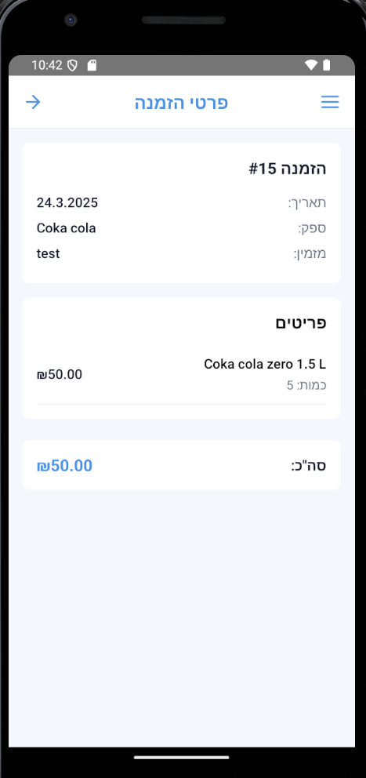
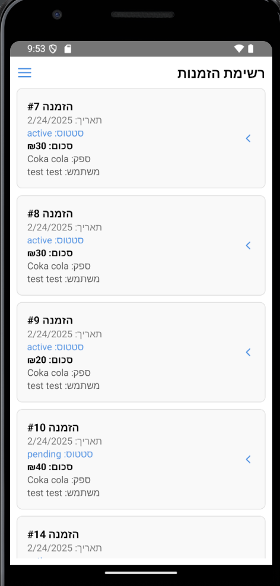
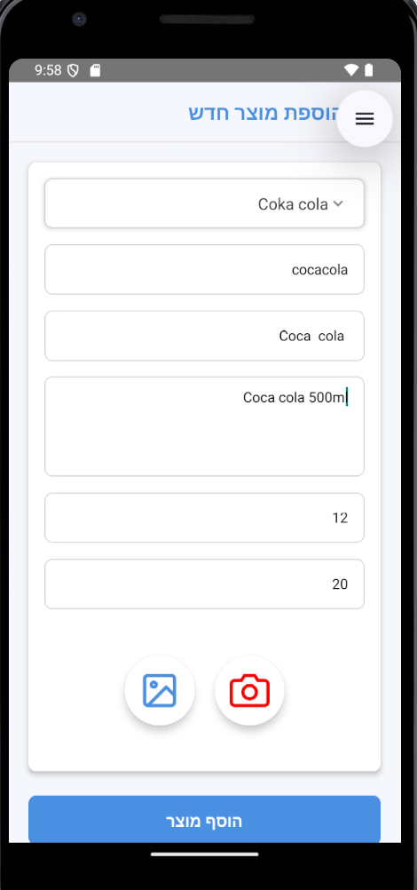

# Supplify

## Overview

Supplify is a mobile application designed to help convenience store employees and managers, as well as specific gas stations, consolidate product orders from multiple suppliers into a single interface. The app automates order preparation and communication, improving efficiency and reducing errors.

## System Architecture Overview

Supplify follows a Client-Server architecture, consisting of:

**Frontend:** A React Native application handling the user interface and API calls.

**Backend:** A Spring Boot server managing business logic and database operations.

**Database:** A MySQL database storing system data.

**WhatsApp Business API (Twilio):** Used for supplier communication and notifications.

## Features

**Supplier Management:** Easily add, remove, and update supplier details.

**Order Consolidation:** Automatically combine orders from different suppliers into a unified order list.

**Automated Communication:** Send orders directly to suppliers via WhatsApp Business API (Twilio).

**User Roles:** Separate views and functionalities for employees and managers

## Backend Code Structure

supplify-backend/
├── src/main/java/com/supplify/

│   ├── entities/         # JPA Entities (e.g., Agent, Supplier, Order)

│   ├── repositories/     # Database access layer (Spring Data JPA)

│   ├── services/         # Business logic layer

│   ├── controllers/      # REST API endpoints

│   ├── dto/              # Data Transfer Objects

│   ├── config/           # Configuration files

│   ├── utils/            # Utility classes

└── src/main/resources/

    ├── application.yml   # Spring Boot configuration

### Installation

#### Backend Setup

1.Clone the repository.

2.Install dependencies:

3.Run the application.

#### Frontend Setup

1.navigate to the frontend directory:

cd ../frontend

2.Install dependencies:

npm install

3.Run the React Native app:

npx react-native run-android

## 📸 Visual
To make this documentation more user-friendly, we’ve included screenshots of the key features of Supplify. These images provide a clear understanding of how the app works, making it easier for new users to navigate and use the system efficiently.

### 1️⃣ Login & Registration

 
  

### 2️⃣ Home Page & SideBar

 
  

### 3️⃣ Orders

 
  

 

### 4️⃣ Add Product & Business

 
  

